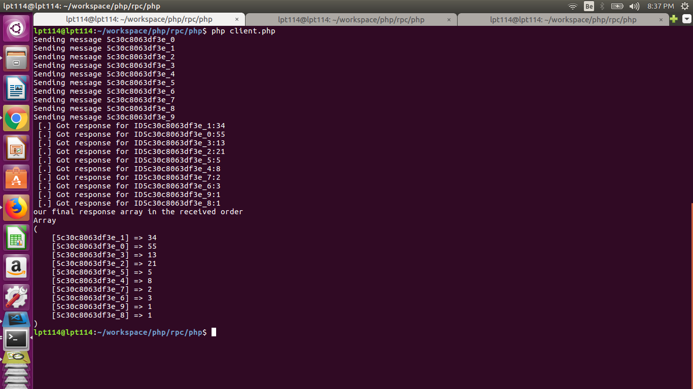
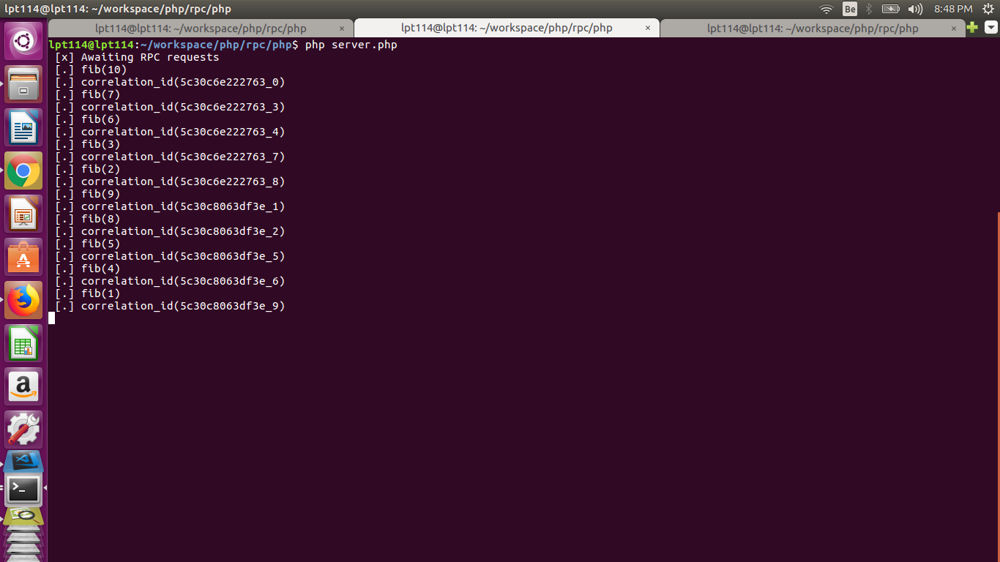
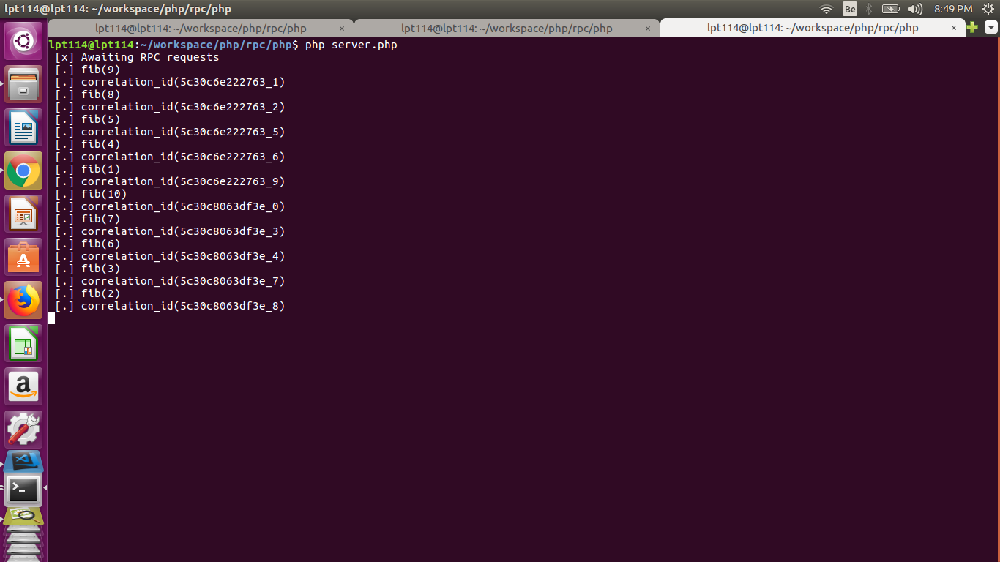

# Rabbitmq RPC Queue

## Why Use RPC pattern
This pattern is used when a remote procedure/function is triggered and need to wait for the  result or completion of execution.

The single threaded applications could leverage this pattern to perform asynchronous tasks.

The aim of this repo is to show-case how RPC could be leveraged in 

## Is RPC synchronous - Why
It is pretty common for apps to process requests as multiple flows and sub flows that is required to wait for the completion of execution at the remote system. Then assemble responses from various flows/sub-flows as response to the client. Which most of them can be processed parallelly.

RPC Queues can be used for asynchronous joins that runs on synchronous backends like php,python.

## Illustration
The sample code illustrates how to send and receive request/responses to rpc_queue.

The sleep is induced to delay the responses from the worker. So as to illustrate, how to deal with client batch processing.

### Sample Illustration in action
Single client sending the request, with 2 rpc workers in action.

#### Client

#### RPC Worker 1

#### RPC Worker 2

## References
[Rabbitmq](https://www.rabbitmq.com/tutorials/tutorial-six-python.html)